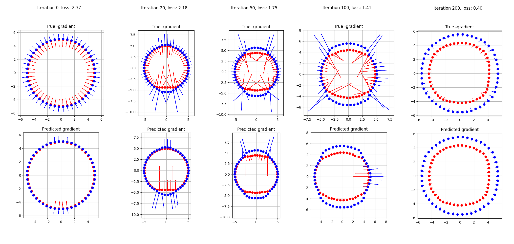
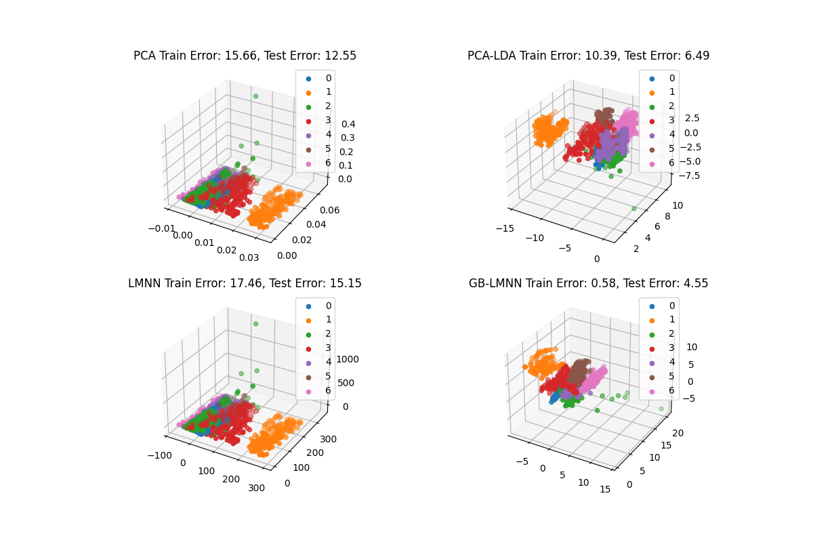

# py-gb-lmnn
## Python implementation of "Non-linear Metric Learning"

 

Non-linear Metric Learning shows a powerful way to solve metric-learning and other related problems like dimensionality reduction using gradient-boosting. This approach is robust, parallelizable, much faster than deep learning and require less training data.
I provide an updated implementation using the SciPy ecosystem.

The code is based on the [original matlab code](https://github.com/gabeos/lmnn). I am very grateful to Killian Weinberger for his help. Please refer to the original paper for details:

> [Kedem, D., Tyree, S., Sha, F., Lanckriet, G. R., & Weinberger, K. Q. (2012). Non-linear metric learning. In Advances in neural information processing systems (pp. 2573-2581).](https://papers.nips.cc/paper/4840-non-linear-metric-learning)


## Installation

Please use Python 3.7 and install the pip dependencies as:

```
pip install -r requirements.txt
```

## Usage

You can execute a comparison of several methods for dimensionality reduction with:
```
python main.py
```

The data set contains 7 classes, each sample contains 29 features and several methods try to reduce from this original space to a 3D space. The plot show how the different methods move the classes in the 3D space. In the ideal case all the classes should look like spheres, being perfectly separable:

  

## Contact
If you have any problem you can contact me (Iago Suárez) in iago.suarez.canosa@alumnos.upm.es . 
I am a computer vision PhD student in Universidad Politécnica de Madrid. My interests are local feature description, deep learning, real-time computing, hashing, metric-learning and image processing. See my [LinkedIn profile here](https://es.linkedin.com/in/iago-suarez).
